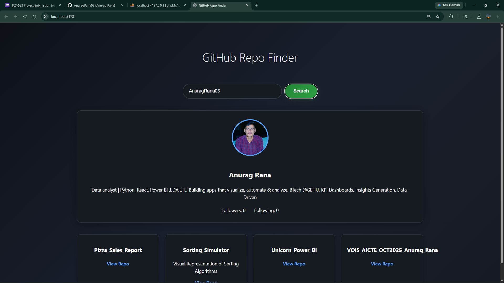
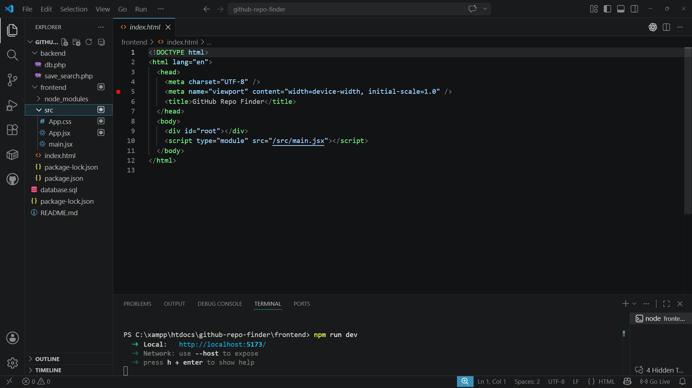
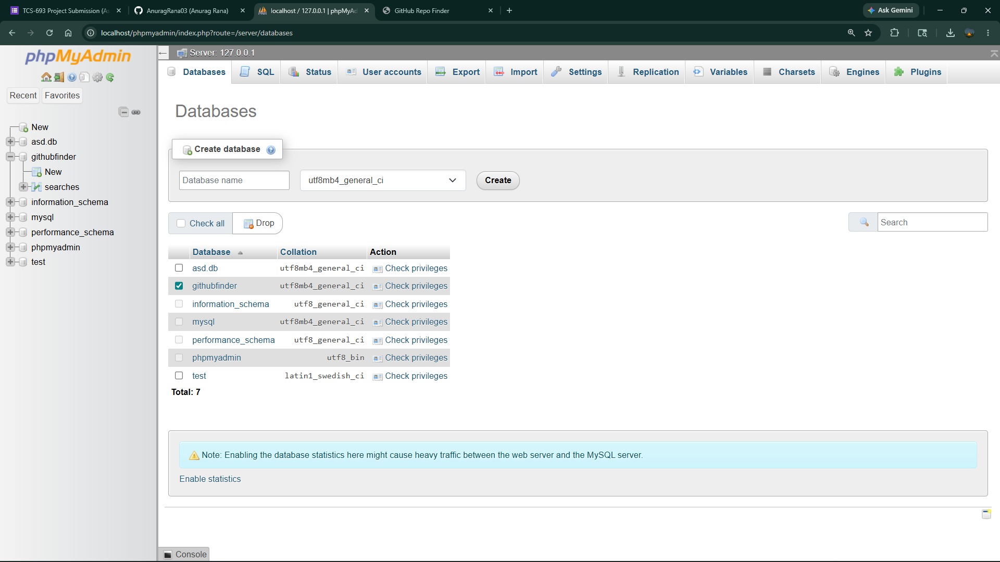
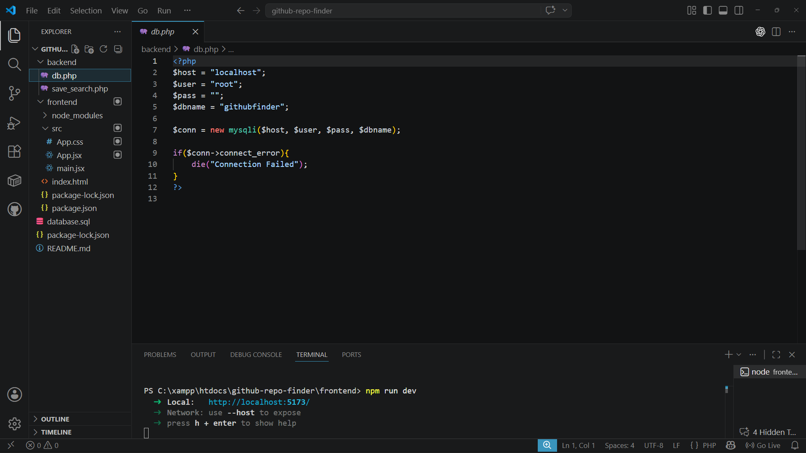

# GitHub Repo Finder

## Setup Frontend
```bash
cd frontend
npm install
npm run dev
```

## Setup Backend
1. Install XAMPP
2. Move backend folder to htdocs
3. Start Apache and MySQL
4. Import database.sql into phpMyAdmin

Backend URL:
http://localhost/backend/save_search.php


## Screenshots

### Frontend



### Database


